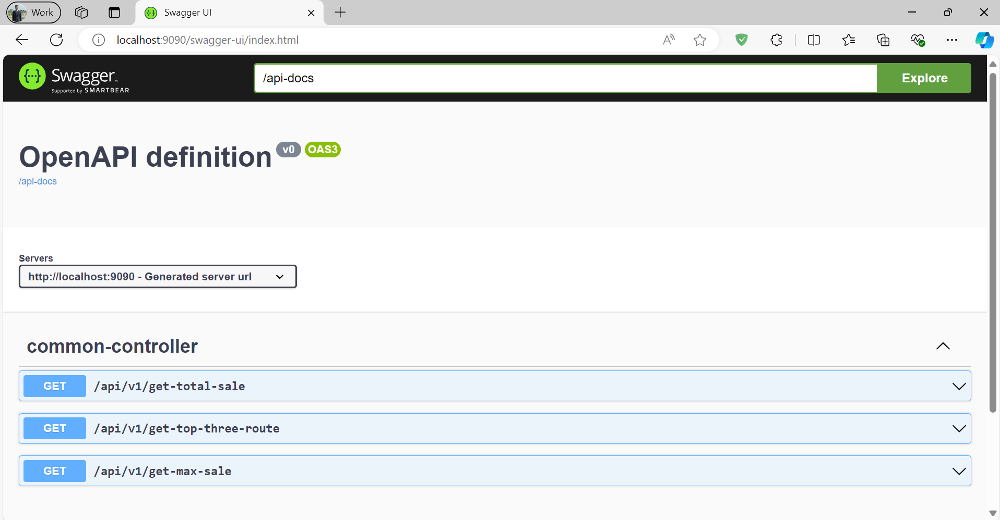

# airlines-demo-project
 
# Task: 
- Create an API to return the total sale amount from tickets and foods of the current day.
- Create an API to return the max sale day of all tickets of a certain time range.
- Create an API to return the top 3 selling routes of all time (based on total sale amount from the tickets).

# Framework Details:
- Spring Boot version(3.3.1)
- JDK 21 
- Latest docker
- PostgreSQL
- Spring AOP
- Actuator
- Swagger

# Docker Files:
- Docker Compose File for PostgreSQL as DB and Application(**'docker-compose.yml'**)
- Docker Application Image(**'Dockerfile'**)

# API List:
- Swagger URL: http://localhost:9090/swagger-ui/index.html
- Postman Collection Shared ('**Airlines-Demo-Project.postman_collection.json**')
- Actuator(health) URL: http://localhost:9090/admin/actuator/health


# Points:
- Logging Implemented using Spring AOP concepts. 
- Log File Name(**'project.log'**)
- Handling Exceptions using Global Controller Advice.
- Initial Data Insert Query Shared. 
- Query File(**data.sql**) in the **resources** folder.
- All kinds of response will be in one common format.

Example 1:
```json
{
  "code": 200,
  "success": true,
  "message": "Successfully get max sale date.",
  "data": [
    {
      "date": "2024-01-01",
      "totalSale": 1000.0
    }
  ]
}
```

Example 2 (Exception):
```json
{
  "code": 400,
  "success": false,
  "message": "Start date cannot be after end date",
  "data": null
}
```

## Guidelines for Run the Project:
- First clone the git repository.
- Using Docker Compose File. Cmd: **docker compose up -d**